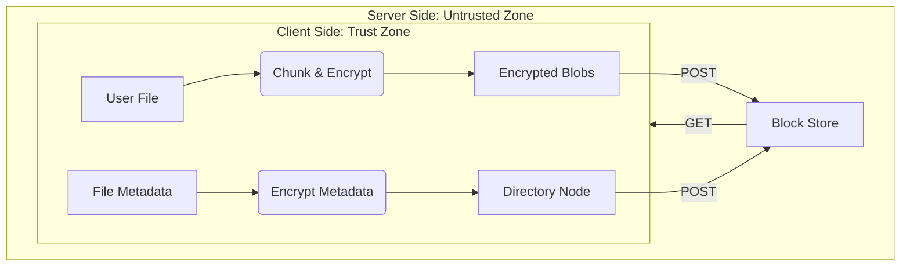
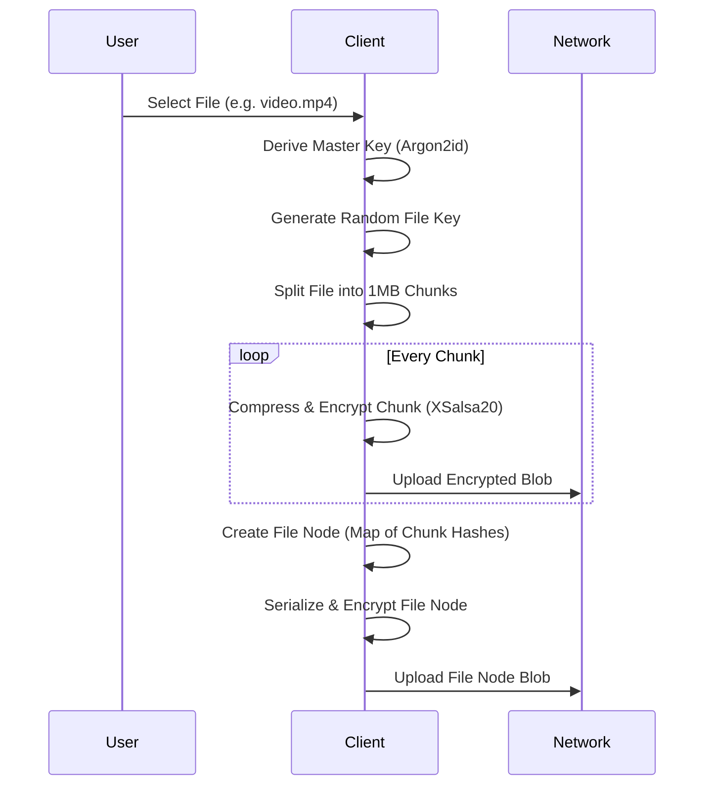
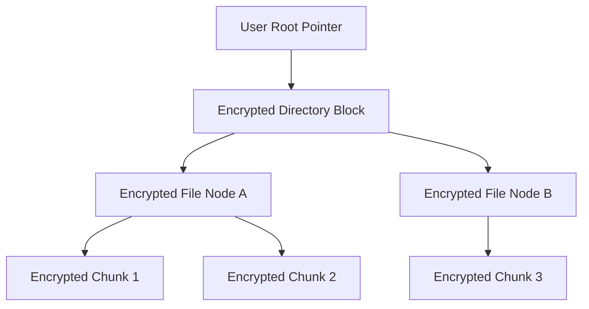
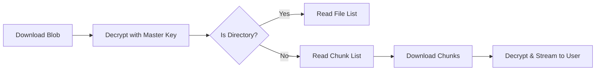
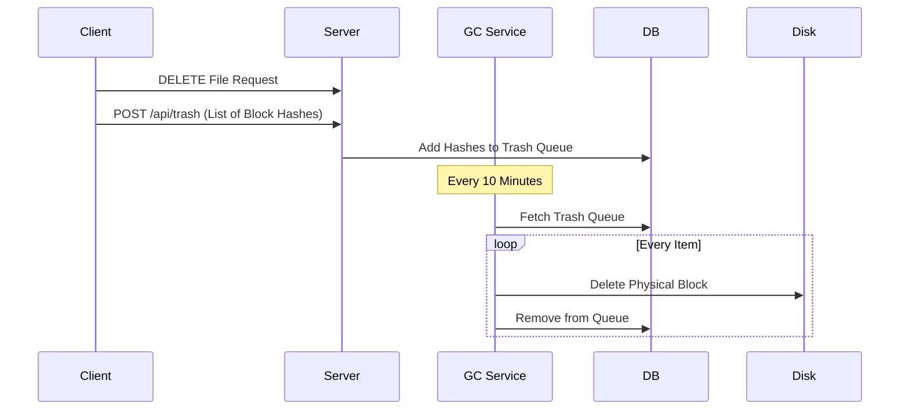

# Haven

Haven is a zero-knowledge cloud storage system designed for absolute privacy. It employs transparent client-side encryption, meaning the server stores only opaque, encrypted chunks and never has access to your actual files. Featuring a secure virtual file system, automated garbage collection, and a completely trustless architecture, Haven ensures your data remains exclusively yours, secure from any prying eyes.

## Architecture Overview

Haven separates the Client (Trust Zone) from the Server (Untrusted Zone). The server acts as a dumb block store.

## Encryption Process

Before any data leaves the client, it is chunked and encrypted using keys derived from your password. We utilize high-performance cryptography (XSalsa20-Poly1305 and Ed25519).

## Storage & Virtual File System

Haven does not use a traditional database for files. It uses a Cryptree (Merkle Tree). Your "Root Directory" is just a pointer to an encrypted block that contains pointers to other blocks.

## Decryption Process

When you view a file, the browser downloads the encrypted chunks and reassembles them in memory. The plaintext never touches the disk.

## Garbage Collection

When a file is deleted, the client marks the blocks as "Trash". The server, unable to read the file tree, relies on this signal to clean up storage.

## Technology Stack

### Backend
- .NET 9 (ASP.NET Core)
- Entity Framework Core (SQLite)
- Sodium.Core (Cryptography)

### Frontend
- Next.js (React 19)
- TailwindCSS
- Lucide Icons
- Libsodium.js (WASM Cryptography)
