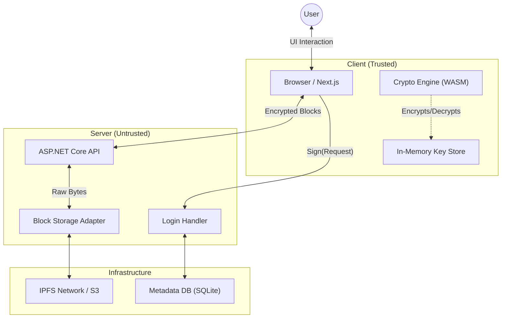

# Haven Architecture Overview

## 1. High-Level Design
Haven is a **Server-Clients** architecture where the server is untrusted (Zero-Knowledge).

### High-Level Architecture Diagram

### The Layers
1.  **Client (Frontend/CLI):**
    *   **Role:** The "Brain". Handles all encryption, decryption, and logic.
    *   **Trust:** Fully trusted by the user.
    *   **Responsibility:** Maintains the "Virtual Drive" state in memory, encrypts data locally, and signs requests.
2.  **Server (Backend/Node):**
    *   **Role:** The "Storage Box" & "Switchboard".
    *   **Trust:** Untrusted (Blind). Cannot see file contents or key material.
    *   **Responsibility:** Stores opaque encrypted blocks, routes messages between users, and connects to the global P2P network (IPFS).
3.  **Storage Layer (IPFS/S3):**
    *   **Role:** The "Hard Drive".
    *   **Trust:** Untrusted.
    *   **Responsibility:** Persists raw encrypted chunks (content-addressed).

## 2. Core Concepts

### A. The Virtual Drive (The "Cryptree")
Unlike a normal filesystem where the server knows `/home/alice/docs/resume.pdf` exists, Haven uses a **Cryptree**.
*   **Root:** Use password derives a root capability (pointer) to the top folder.
*   **Navigation:** To list a folder, the client downloads the folder's encrypted block, decrypts it locally, and sees the names of the files inside.
*   **Result:** The server sees only "User X accessed Block Y", but doesn't know if Block Y is a folder, a movie, or a text file.

### B. Identity
*   **No Central Registry:** Identities are public keys.
*   **Username:** A human-readable Claim on a PKI (Public Key Infrastructure) server that maps `username -> public_key`.

## 3. Data Flow Example: Uploading a File
1.  **Select:** User selects `photo.jpg`.
2.  **Chunk:** Client cuts `photo.jpg` into 5MB chunks.
3.  **Encrypt:** Client generates a random key `$K` and encrypts chunks -> `Enc($K, chunk)`.
4.  **Upload:** Client sends encrypted chunks to Server. Server stores them and returns Hash/ID.
5.  **Metadata:** Client creates a `FileNode` object containing `$K` and the Hash/IDs of the chunks.
6.  **Link:** Client updates the Parent Directory to point to this new `FileNode`.
7.  **Sign:** Client signs the new Parent Directory state and uploads it.
