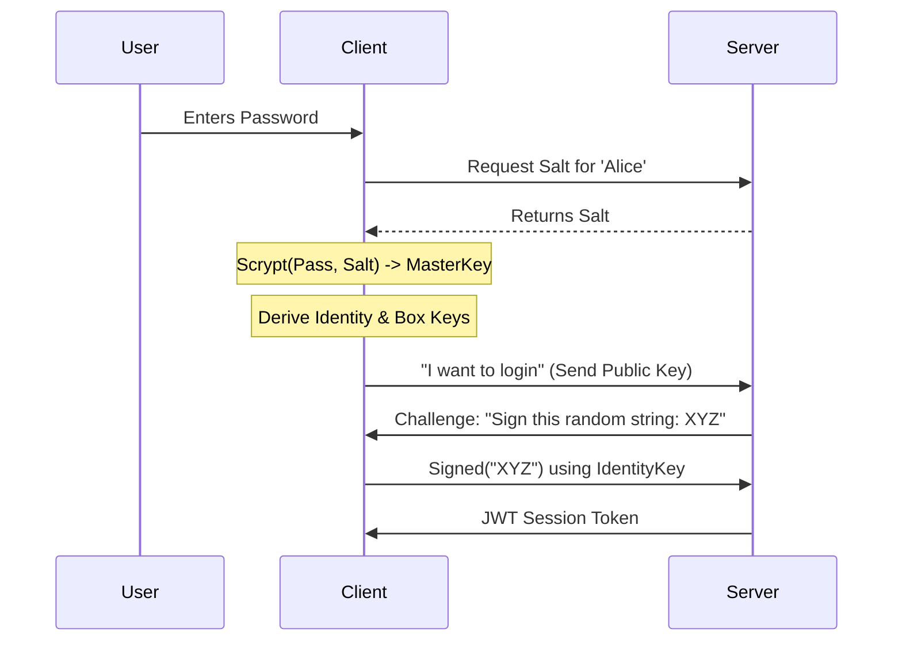

# Haven Cryptography & Security

Haven allows users to store data on a server they **do not trust**. This is achieved through strong client-side encryption.

## 1. Primitives
We use **modern, high-speed, and secure** algorithms (based on TweetNaCl/libsodium).

| Component | Algorithm | Purpose |
| :--- | :--- | :--- |
| **Symmetric Encryption** | **XSalsa20-Poly1305** | Encrypting file chunks & metadata. Fast & authenticated. |
| **Signing (Identity)** | **Ed25519** | Proving identity (Login, Write Access). |
| **Key Exchange (Sharing)** | **Curve25519** | Sharing files securely with other users. |
| **Post-Quantum Security** | **ML-KEM (Kyber)** | (Optional/Hybrid) Protecting shared data against future quantum computers. |
| **Hashing** | **SHA-256 / Blake2b** | Integrity checks and Content Addressing. |
| **Key Derivation** | **Scrypt** | Protecting passwords against brute-force attacks. |

## 2. The Login Process (Zero-Knowledge)
The server **never** sees your password.

1.  **User Input:** `Username` + `Password`.
2.  **Salt:** Client requests a random salt from Server.
3.  **Derivation:** Client computes `MasterKey = Scrypt(Password, Salt, N=131072, r=8, p=1)`.
    *   *Note: This is computationally expensive (takes ~0.5s) to stop hackers trying millions of passwords.*
4.  **Key Generation:**
    *   `IdentityKeyPair` (Signing) is derived deterministically from `MasterKey`.
    *   `BoxKeyPair` (Encryption) is derived deterministically from `MasterKey`.
5.  **Challenge:**
    *   Server creates a random `ChallengeString`.
    *   Client signs `ChallengeString` with `IdentityKeyPair`.
    *   Server validates signature. **Success!**

## 3. File Encryption
Every file has its own random key.

*   **File Key ($F_k$):** A random 32-byte key generated when the file is created.
*   **Chunks:** The file is split into blocks. Each block is encrypted with derived sub-keys from $F_k$.
*   **Metadata:** The $F_k$ itself is stored in the **Parent Directory**.
*   **Root Directory:** The key to the root directory is encrypted using the user's `MasterKey` (derived from password).

## 4. Sharing (Access Control)
How do you share `vacation.jpg` with Bob without giving him your password?

1.  **Bob's Public Key:** You look up Bob's `BoxPublicKey`.
2.  **Wrappings:** You take the file's key ($F_k$) and **encrypt it using Bob's Public Key**.
    *   `EncryptedKey = Box(Bob.PublicKey, My.PrivateKey, F_k)`
3.  **Delivery:** You write this `EncryptedKey` to a shared space.
4.  **Access:** Bob downloads it, decrypts it with his `PrivateKey` to get $F_k$, and can now read the file.
