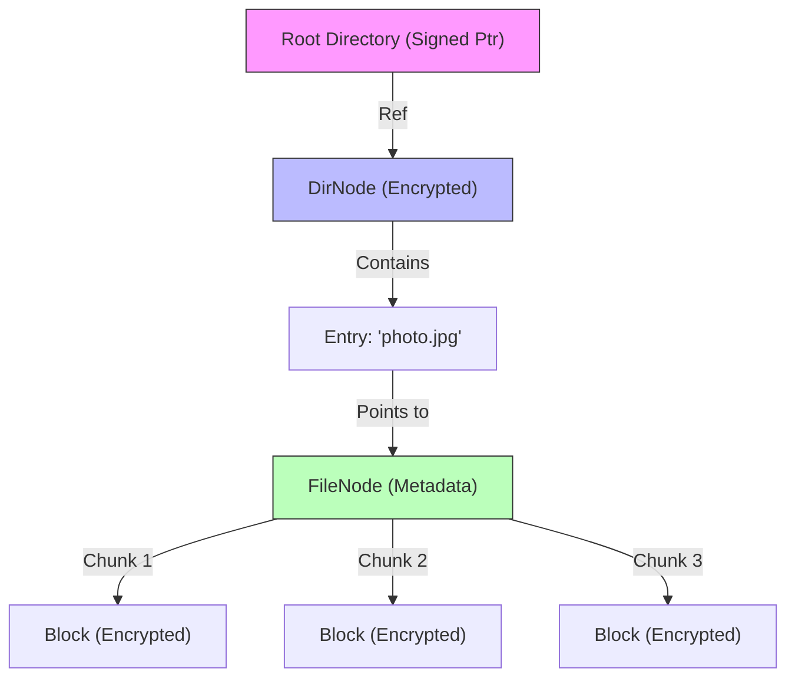

# Haven Storage Engine

How data is physically stored and organized.

## 1. The Block Store (IPFS)
At the lowest level, Haven is a **Content-Addressed Storage** system.
*   **Blob:** A chunk of binary data.
*   **CID (Content ID):** The Hash of the blob (e.g., `QmXoyp...`).
*   **Property:** If you ask for `QmXoyp...`, you are guaranteed to get the exact same bytes every time.
*   **Encryption:** All blocks are encrypted **before** hashing. The storage layer sees random noise.

## 2. The Cryptree Structure
Haven builds a filesystem **on top** of the Block Store using a structure called a **Cryptree** (similar to Wuala).

### Node Types

1.  **DirNode (Directory):**
    *   Contains a list of `Child` entries.
    *   Each `Child` has: `Name`, `Key` (for the child), and `CID` (pointer to the child's data).
    *   **Security:** To read a directory, you need its `ReadCapability` (WriteKey + ReadKey).
2.  **FileNode (File):**
    *   Contains property metadata (MIME type, size).
    *   Contains a list of `Block` pointers (CIDs) that make up the file.

### 3. Mutable Pointers (The "Champ")
Files change. IPFS blocks are immutable. How do we update a file?

*   **Updates:** When `file.txt` is modified, we create a new `FileNode` with a new CID.
*   **Propagation:** The parent directory must be updated to point to the new `FileNode` CID. This changes the parent's CID.
*   **The Root:** This change bubbles all the way up to the **Root Directory**.
*   **Mutable Pointer:** The User's Identity has a **Signed Pointer** to the current Root Directory CID.
    *   `User -> [Signature] -> RootCID`.
    *   When you save a file, you update this signed pointer to the new Root.

### 4. Large Directories (HAMT)
For folders with thousands of files, a simple list is too slow.
*   **HAMT (Hash Array Mapped Trie):** A tree structure that allows finding a file using its name's hash in $O(log n)$ time.
*   Instead of downloading the whole folder list, we download just the branch of the tree corresponding to the file name.
